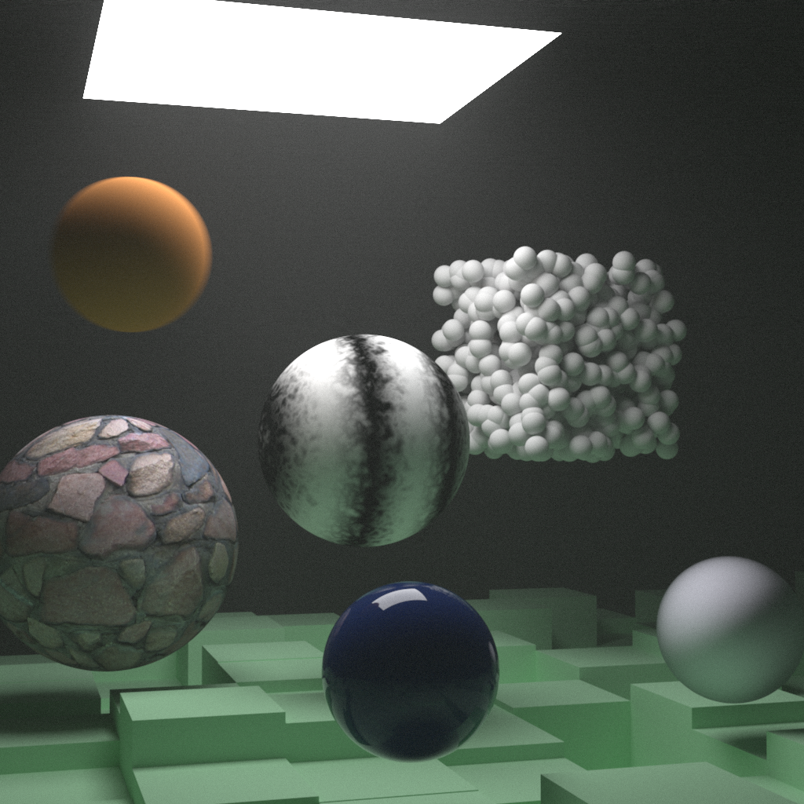

# Rust implementation of 'Ray tracer in one week(end)' series 

To render build with 
```bash
RUSTFLAGS=-C target-cpu=native cargo build --release
```
 and then `./do-render.sh release` . 
 The rendered image will be in `renders/` subdirectory.

If you have `mogrify` installed it will be converted to PNG, otherwise left as PPM. 
## Examples

1024x1024, 10k samples per pixel, up to 8 bounces per ray

The image above was rendered on i5-8250U in:  

    real	1388m32.324s
    user	11028m35.198s
    sys	9m9.747s
