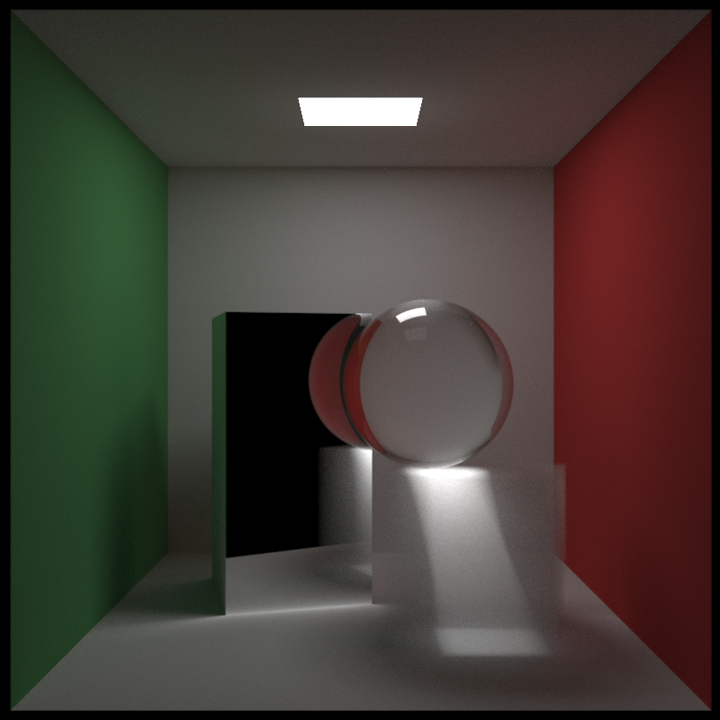
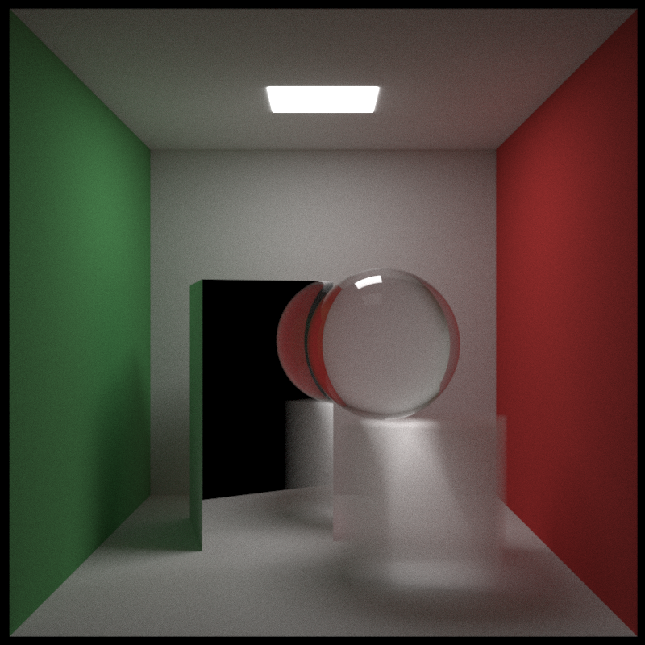

# Rust implementation of 'Ray tracer in one week(end)' series 

To render build with 
```bash
RUSTFLAGS=-C target-cpu=native cargo build --release
```
 and then `./do-render.sh release` . 
 The rendered image will be in `renders/` subdirectory.

If you have `mogrify` installed it will be converted to PNG, otherwise left as PPM. 
## Examples

1024x1024, 10k samples per pixel, up to 8 bounces per ray, unbiased

## Biased vs Unbiased

800x800, 10k samples per pixel, up to 16 bounces per ray, biased towards light, boxes and ball


800x800, 10k samples per pixel, up to 16 bounces per ray, unbiased

For the same number of samples biased renderer gives harder light and less noise, which is redistributed 
into caustics brightness, making image darker overall, at the same time it is slower, 
so generating image with same level of noise with the biased renderer is not very much faster 
than unbiased one, but caustics quality and light softness changes as well, making selection 
between biased and unbiased renderer more of an artistic choice.

